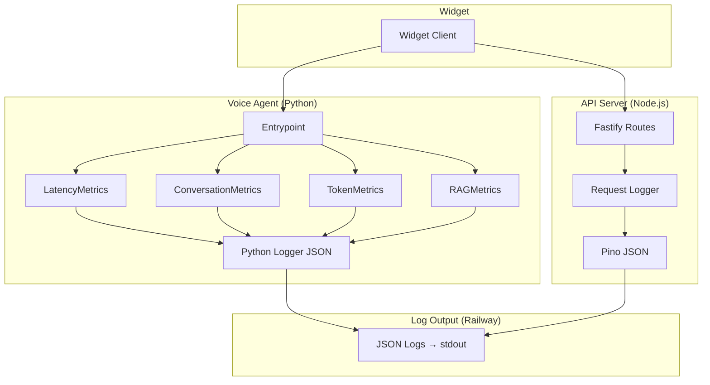

# Design Document: Structured Logging & Observability

## Overview

This design adds structured logging to track voice pipeline latency, conversation metrics, LLM costs, and RAG performance using the existing Pino (API) and Python logging (Voice Agent) infrastructure. No new external tools or services are introduced.

The implementation enhances existing logging with:
- Consistent JSON field naming across services
- Timing instrumentation at each pipeline stage
- Token usage tracking for cost estimation
- Correlation IDs for cross-service tracing

## Architecture



## Components and Interfaces

### 1. Voice Agent Metrics Module (`apps/voice-agent/src/metrics.py`)

A new module providing structured logging helpers for the voice pipeline.

```python
from dataclasses import dataclass
from typing import Optional
import time
import logging

@dataclass
class PipelineMetrics:
    """Tracks timing for a single voice pipeline execution."""
    session_id: str
    project_id: str
    turn_number: int
    stt_start_ms: Optional[float] = None
    stt_duration_ms: Optional[float] = None
    rag_duration_ms: Optional[float] = None
    rag_embedding_duration_ms: Optional[float] = None
    llm_duration_ms: Optional[float] = None
    tts_duration_ms: Optional[float] = None
    input_tokens: int = 0
    output_tokens: int = 0
    model: str = ""
    
    def total_latency_ms(self) -> float:
        """Calculate end-to-end latency."""
        return sum(filter(None, [
            self.stt_duration_ms,
            self.rag_duration_ms,
            self.llm_duration_ms,
            self.tts_duration_ms
        ]))

class MetricsLogger:
    """Structured logging for voice pipeline metrics."""
    
    def __init__(self, logger: logging.Logger):
        self.logger = logger
    
    def log_stt_complete(self, metrics: PipelineMetrics) -> None:
        """Log STT completion with duration."""
        self.logger.info(
            "STT completed",
            extra={
                "event_type": "stt_complete",
                "session_id": metrics.session_id,
                "project_id": metrics.project_id,
                "turn_number": metrics.turn_number,
                "duration_ms": metrics.stt_duration_ms,
            }
        )
    
    def log_rag_complete(
        self, 
        metrics: PipelineMetrics,
        result_count: int,
        top_score: Optional[float] = None
    ) -> None:
        """Log RAG search completion."""
        event_type = "rag_complete" if result_count > 0 else "rag_miss"
        self.logger.info(
            "RAG search completed",
            extra={
                "event_type": event_type,
                "session_id": metrics.session_id,
                "project_id": metrics.project_id,
                "turn_number": metrics.turn_number,
                "duration_ms": metrics.rag_duration_ms,
                "embedding_duration_ms": metrics.rag_embedding_duration_ms,
                "result_count": result_count,
                "top_score": top_score,
            }
        )
    
    def log_llm_complete(self, metrics: PipelineMetrics) -> None:
        """Log LLM completion with token counts."""
        self.logger.info(
            "LLM completed",
            extra={
                "event_type": "llm_complete",
                "session_id": metrics.session_id,
                "project_id": metrics.project_id,
                "turn_number": metrics.turn_number,
                "duration_ms": metrics.llm_duration_ms,
                "input_tokens": metrics.input_tokens,
                "output_tokens": metrics.output_tokens,
                "model": metrics.model,
            }
        )
    
    def log_tts_complete(self, metrics: PipelineMetrics) -> None:
        """Log TTS completion."""
        self.logger.info(
            "TTS completed",
            extra={
                "event_type": "tts_complete",
                "session_id": metrics.session_id,
                "project_id": metrics.project_id,
                "turn_number": metrics.turn_number,
                "duration_ms": metrics.tts_duration_ms,
            }
        )
    
    def log_turn_complete(self, metrics: PipelineMetrics, query_length: int) -> None:
        """Log complete turn with total latency."""
        self.logger.info(
            "Turn completed",
            extra={
                "event_type": "turn_complete",
                "session_id": metrics.session_id,
                "project_id": metrics.project_id,
                "turn_number": metrics.turn_number,
                "total_latency_ms": metrics.total_latency_ms(),
                "query_length": query_length,
                "stt_duration_ms": metrics.stt_duration_ms,
                "rag_duration_ms": metrics.rag_duration_ms,
                "llm_duration_ms": metrics.llm_duration_ms,
                "tts_duration_ms": metrics.tts_duration_ms,
            }
        )
```

### 2. Conversation Metrics (`apps/voice-agent/src/metrics.py`)

```python
@dataclass
class ConversationMetrics:
    """Tracks metrics for an entire conversation session."""
    session_id: str
    project_id: str
    start_time_ms: float
    turn_count: int = 0
    total_input_tokens: int = 0
    total_output_tokens: int = 0
    interruption_count: int = 0
    termination_reason: Optional[str] = None

class ConversationLogger:
    """Structured logging for conversation-level metrics."""
    
    def __init__(self, logger: logging.Logger):
        self.logger = logger
    
    def log_conversation_start(self, metrics: ConversationMetrics) -> None:
        """Log conversation start."""
        self.logger.info(
            "Conversation started",
            extra={
                "event_type": "conversation_start",
                "session_id": metrics.session_id,
                "project_id": metrics.project_id,
            }
        )
    
    def log_conversation_end(self, metrics: ConversationMetrics) -> None:
        """Log conversation end with summary metrics."""
        duration_ms = time.time() * 1000 - metrics.start_time_ms
        self.logger.info(
            "Conversation ended",
            extra={
                "event_type": "conversation_end",
                "session_id": metrics.session_id,
                "project_id": metrics.project_id,
                "duration_ms": duration_ms,
                "turn_count": metrics.turn_count,
                "total_input_tokens": metrics.total_input_tokens,
                "total_output_tokens": metrics.total_output_tokens,
                "interruption_count": metrics.interruption_count,
                "termination_reason": metrics.termination_reason or "normal",
            }
        )
    
    def log_interruption(self, metrics: ConversationMetrics, context: str) -> None:
        """Log user interruption event."""
        self.logger.info(
            "User interrupted",
            extra={
                "event_type": "interruption",
                "session_id": metrics.session_id,
                "project_id": metrics.project_id,
                "turn_number": metrics.turn_count,
                "context": context,
            }
        )
```

### 3. API Request Logging Enhancement (`apps/api/src/middleware/request-logger.ts`)

Enhance existing Pino logging with request duration and correlation IDs.

```typescript
import { FastifyRequest, FastifyReply } from 'fastify';
import { Logger } from 'pino';

export function createRequestLogger(logger: Logger) {
  return async function requestLogger(
    request: FastifyRequest,
    reply: FastifyReply
  ) {
    const startTime = Date.now();
    
    // Add correlation ID from header or generate
    const correlationId = request.headers['x-correlation-id'] as string 
      || request.id;
    
    reply.header('x-correlation-id', correlationId);
    
    // Log on response finish
    reply.raw.on('finish', () => {
      const duration_ms = Date.now() - startTime;
      
      logger.info({
        event_type: 'http_request',
        correlation_id: correlationId,
        method: request.method,
        url: request.url,
        status_code: reply.statusCode,
        duration_ms,
        project_id: (request as any).projectId, // Set by auth middleware
        session_id: (request as any).sessionId,
      }, 'Request completed');
    });
  };
}
```

### 4. Python JSON Log Formatter (`apps/voice-agent/src/logging_config.py`)

Configure Python logging to output JSON matching Pino format.

```python
import json
import logging
from datetime import datetime
from typing import Any

class JSONFormatter(logging.Formatter):
    """JSON formatter matching Pino output structure."""
    
    def format(self, record: logging.LogRecord) -> str:
        log_data: dict[str, Any] = {
            "level": record.levelname.lower(),
            "time": datetime.utcnow().isoformat() + "Z",
            "msg": record.getMessage(),
        }
        
        # Add extra fields (our structured data)
        if hasattr(record, '__dict__'):
            for key, value in record.__dict__.items():
                if key not in (
                    'name', 'msg', 'args', 'created', 'filename',
                    'funcName', 'levelname', 'levelno', 'lineno',
                    'module', 'msecs', 'pathname', 'process',
                    'processName', 'relativeCreated', 'stack_info',
                    'exc_info', 'exc_text', 'thread', 'threadName',
                    'taskName', 'message'
                ):
                    log_data[key] = value
        
        return json.dumps(log_data)

def configure_logging(level: str = "INFO") -> None:
    """Configure root logger with JSON output."""
    handler = logging.StreamHandler()
    handler.setFormatter(JSONFormatter())
    
    root_logger = logging.getLogger()
    root_logger.setLevel(getattr(logging, level.upper()))
    root_logger.handlers = [handler]
```

## Data Models

### Log Event Schema

All log events follow this base schema:

| Field | Type | Required | Description |
|-------|------|----------|-------------|
| `level` | string | Yes | Log level (info, warn, error, debug) |
| `time` | string | Yes | ISO 8601 timestamp |
| `msg` | string | Yes | Human-readable message |
| `event_type` | string | Yes | Event category for filtering |
| `session_id` | string | Conditional | Voice session identifier |
| `project_id` | string | Conditional | Project identifier |
| `duration_ms` | number | Conditional | Duration in milliseconds |

### Event Types

| Event Type | Service | Description |
|------------|---------|-------------|
| `stt_complete` | Voice Agent | STT transcription finished |
| `rag_complete` | Voice Agent | RAG search with results |
| `rag_miss` | Voice Agent | RAG search with no results |
| `llm_complete` | Voice Agent | LLM response generated |
| `tts_complete` | Voice Agent | TTS audio generated |
| `turn_complete` | Voice Agent | Full turn finished |
| `conversation_start` | Voice Agent | Session began |
| `conversation_end` | Voice Agent | Session ended |
| `interruption` | Voice Agent | User interrupted agent |
| `http_request` | API | HTTP request completed |
| `token_validation` | API | Widget token validated |

## Correctness Properties

*A property is a characteristic or behavior that should hold true across all valid executions of a system-essentially, a formal statement about what the system should do. Properties serve as the bridge between human-readable specifications and machine-verifiable correctness guarantees.*

### Property 1: Pipeline Stage Logging Completeness
*For any* completed voice turn, the logs SHALL contain entries for all executed pipeline stages (STT, RAG if called, LLM, TTS) with valid `duration_ms` values greater than zero.
**Validates: Requirements 1.2, 1.3, 1.4, 1.5**

### Property 2: Total Latency Consistency
*For any* turn_complete log entry, the `total_latency_ms` value SHALL equal the sum of the individual stage durations (`stt_duration_ms` + `rag_duration_ms` + `llm_duration_ms` + `tts_duration_ms`).
**Validates: Requirements 1.6**

### Property 3: Conversation Lifecycle Logging
*For any* conversation, there SHALL be exactly one `conversation_start` event followed by exactly one `conversation_end` event with matching `session_id`.
**Validates: Requirements 2.1, 2.2**

### Property 4: Turn Sequence Monotonicity
*For any* sequence of turn_complete events within a session, the `turn_number` values SHALL be strictly increasing starting from 1.
**Validates: Requirements 2.3**

### Property 5: Token Count Accumulation
*For any* conversation_end event, the `total_input_tokens` and `total_output_tokens` SHALL equal the sum of all `input_tokens` and `output_tokens` from llm_complete events in that session.
**Validates: Requirements 3.1, 3.2, 3.4**

### Property 6: RAG Result Logging Consistency
*For any* RAG search, the log SHALL contain either `rag_complete` with `result_count > 0` and valid `top_score`, OR `rag_miss` with `result_count = 0`.
**Validates: Requirements 4.2, 4.3**

### Property 7: JSON Format Validity
*For any* log line output by either service, the line SHALL parse as valid JSON with required fields (`level`, `time`, `msg`, `event_type`).
**Validates: Requirements 6.1, 6.2, 6.5**

### Property 8: Field Naming Consistency
*For any* log entry containing timing data, the field name SHALL be `duration_ms` (not `latency`, `time_ms`, or other variants).
**Validates: Requirements 6.3**

### Property 9: Identifier Field Consistency
*For any* log entry containing identifiers, the field names SHALL be exactly `project_id`, `session_id`, `conversation_id`, or `turn_id` as applicable.
**Validates: Requirements 6.4**

## Error Handling

### Metrics Collection Failures
- If timing instrumentation fails, log a warning but continue processing
- Never block the voice pipeline for metrics collection
- Use default values (0 or null) for missing metrics

### Log Output Failures
- If JSON serialization fails, fall back to plain text logging
- Never raise exceptions from logging code
- Truncate oversized log fields (e.g., long queries) to prevent log bloat

### Sensitive Data Protection
- Never log user speech transcripts in full (log length only)
- Never log API keys, tokens, or secrets
- Redact PII from error messages

## Testing Strategy

### Unit Testing
- Test `PipelineMetrics.total_latency_ms()` calculation
- Test `JSONFormatter` output structure
- Test field name consistency in log helpers
- Test error handling when metrics are missing

### Property-Based Testing
Using `hypothesis` (Python) and `fast-check` (TypeScript):

- **Property 1**: Generate random pipeline executions, verify all stages logged
- **Property 2**: Generate random stage durations, verify sum equals total
- **Property 3**: Generate random session lifecycles, verify start/end pairing
- **Property 4**: Generate random turn sequences, verify monotonic numbering
- **Property 5**: Generate random token counts per turn, verify accumulation
- **Property 6**: Generate random RAG results, verify event type matches result count
- **Property 7**: Generate random log events, verify JSON validity
- **Property 8-9**: Generate random log entries, verify field naming

### Integration Testing
- End-to-end test: Complete voice turn produces expected log sequence
- Cross-service test: Correlation IDs propagate from API to Voice Agent
- Error scenario test: Failures produce appropriate error logs
