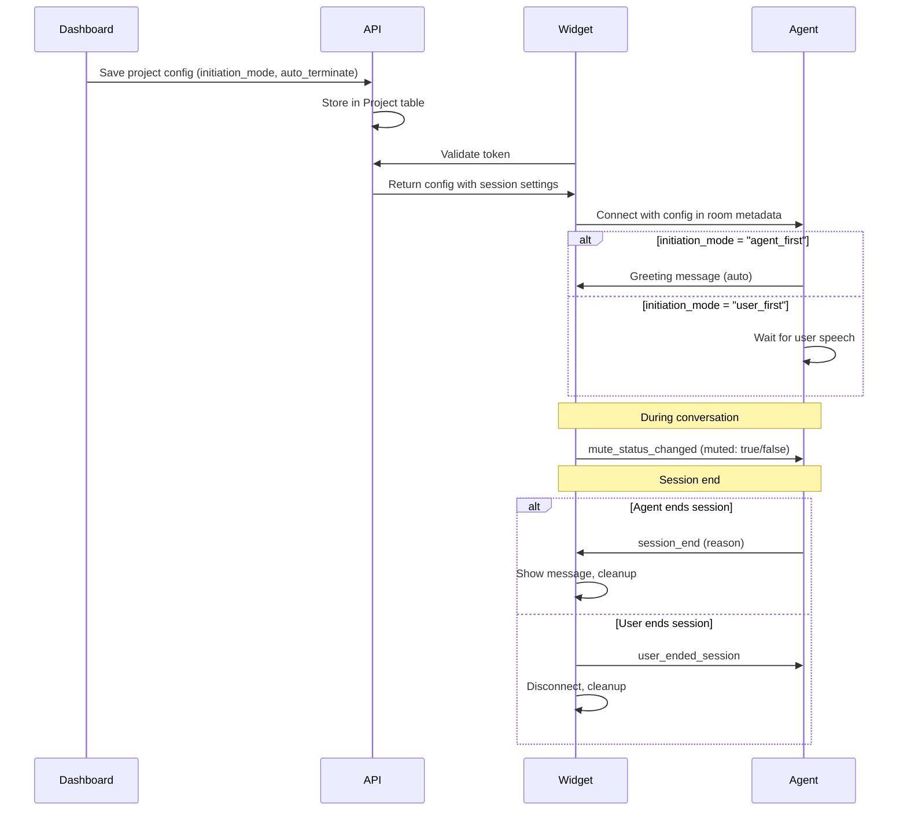

# Design Document: Session Control Features

## Overview

This design adds three key session control capabilities to the Vakkya voice widget:
1. **Conversation Initiation Mode** - Configure whether agent or user speaks first
2. **Session Termination** - Agent and user can end sessions with proper cleanup
3. **Mute/Unmute** - User can toggle microphone without ending session

These features enhance user experience and give project owners more control over conversation flow.

## Architecture

### Component Interaction Flow



## Components and Interfaces

### 1. Database Schema Changes

Add fields to `Project` model in Prisma:

```prisma
model Project {
  // ... existing fields
  
  // Session control settings
  initiationMode    String   @default("agent_first") // "agent_first" | "user_first"
  autoTerminate     Boolean  @default(true)
}
```

### 2. API Changes

#### Token Validation Response Enhancement

```typescript
// apps/api/src/routes/widget.routes.ts
interface TokenValidationResponse {
  livekitUrl: string;
  livekitToken: string;
  projectId: string;
  // New fields
  sessionConfig: {
    initiationMode: 'agent_first' | 'user_first';
    autoTerminate: boolean;
  };
}
```

### 3. Widget Changes

#### New Data Channel Messages

```javascript
// Widget → Agent
{ type: 'mute_status_changed', muted: boolean }
{ type: 'user_ended_session' }

// Agent → Widget  
{ type: 'session_end', reason: string, message?: string }
```

#### Mute State Management

```javascript
// apps/widget/src/livekit-manager.js
function setMuted(muted: boolean) {
  if (localAudioTrack) {
    localAudioTrack.mute(muted);
    publishMessage({ type: 'mute_status_changed', muted });
  }
}
```

### 4. Voice Agent Changes

#### AgentConfig Enhancement

```python
# apps/voice-agent/src/models.py
@dataclass
class AgentConfig:
    system_prompt: Optional[str] = None
    agent_name: Optional[str] = None
    # New fields
    initiation_mode: str = "agent_first"  # "agent_first" | "user_first"
    auto_terminate: bool = True
```

#### Session End Tool

```python
# New tool in form_capability.py or core_capability.py
@function_tool()
async def end_session(
    context: RunContext[Any],
    reason: str,
) -> str:
    """End the current voice session.
    
    Args:
        reason: One of "conversation_complete", "user_inactive", 
                "form_submitted", "user_requested", "error"
    """
```

## Data Models

### Session Configuration

| Field | Type | Default | Description |
|-------|------|---------|-------------|
| initiationMode | enum | "agent_first" | Who speaks first |
| autoTerminate | boolean | true | Agent can end sessions |

### Termination Reasons

| Reason | Description |
|--------|-------------|
| conversation_complete | Natural end of conversation |
| user_inactive | User hasn't spoken for extended period |
| form_submitted | Form was successfully submitted |
| user_requested | User asked to end |
| error | Technical error occurred |

### Voice Status States

| State | Visual Indicator | Status Text |
|-------|------------------|-------------|
| idle | Neutral mic button | (none) |
| listening | Pulsing animation + waveform | "Listening..." |
| processing | Animated dots | "Thinking..." |
| speaking | Waveform visualization | "Speaking..." |
| muted | Crossed-out mic (distinct color) | "Muted" |

Note: Muted state overrides other states visually.

## Correctness Properties

*A property is a characteristic or behavior that should hold true across all valid executions of a system-essentially, a formal statement about what the system should do. Properties serve as the bridge between human-readable specifications and machine-verifiable correctness guarantees.*

### Property 1: Initiation Mode Default
*For any* project without explicit initiation mode configuration, the system shall default to "agent_first" behavior.
**Validates: Requirements 1.4, 6.3**

### Property 2: Valid Termination Reasons
*For any* session termination by the agent, the reason shall be one of the predefined valid reasons: "conversation_complete", "user_inactive", "form_submitted", "user_requested", "error".
**Validates: Requirements 2.2, 2.6**

### Property 3: Mute Toggle State Consistency
*For any* mute toggle action, the audio track muted state shall match the requested mute state (muted=true means track is muted, muted=false means track is enabled).
**Validates: Requirements 3.2, 3.3**

### Property 4: Mute Notification Delivery
*For any* mute state change, a "mute_status_changed" data channel message shall be created with the correct muted boolean value.
**Validates: Requirements 3.5**

### Property 5: Session End Message Ordering
*For any* user-initiated session end, the "user_ended_session" message shall be sent before the disconnect operation begins.
**Validates: Requirements 4.3**

### Property 6: Configuration Persistence Round Trip
*For any* session configuration with valid initiationMode and autoTerminate values, saving and then retrieving shall return identical values.
**Validates: Requirements 6.1, 6.2, 6.4**

## Error Handling

| Scenario | Handling |
|----------|----------|
| Mute fails | Log error, show visual feedback, don't crash |
| Session end message fails | Proceed with disconnect anyway |
| Invalid termination reason | Log warning, use "error" as fallback |
| Config missing | Use defaults, log warning |

## Testing Strategy

### Unit Tests
- Test mute/unmute state transitions
- Test termination reason validation
- Test configuration defaults

### Property-Based Tests
- Use fast-check for JavaScript widget tests
- Use Hypothesis for Python agent tests
- Test state machine transitions with random inputs

### Integration Tests
- Test full flow: config → connect → mute → unmute → end
- Test agent-initiated termination flow
